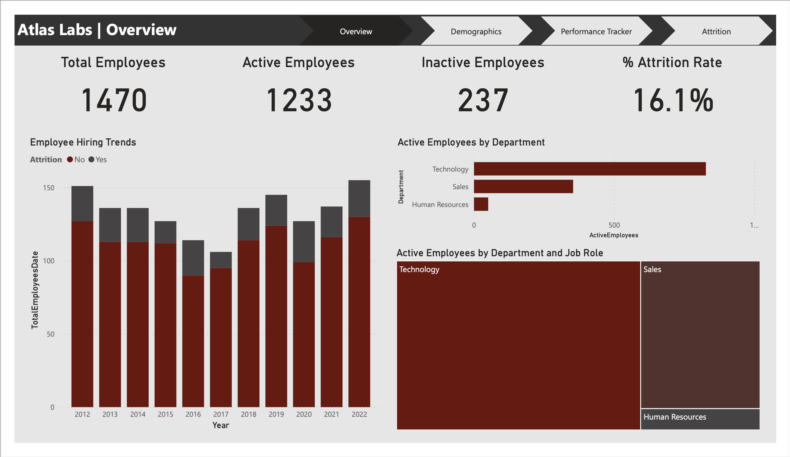
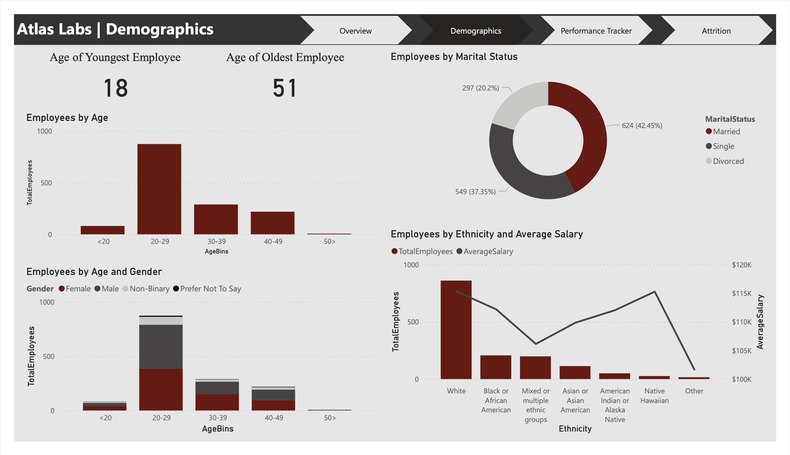
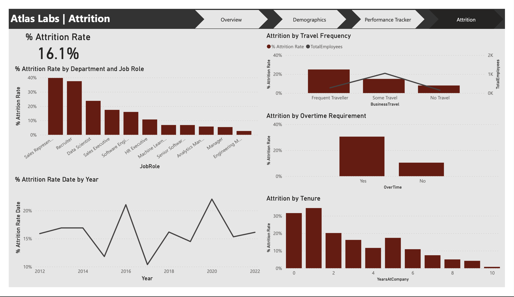

# HR Analytics

## Project Overview

This project entails the creation of a comprehensive HR Analytics report using Microsoft Power BI, aiming to provide detailed insights into various HR metrics for informed decision-making regarding workforce management.

## Project Description

### Overview

The Overview section presents a high-level summary of key HR metrics, including the total number of employees, breakdown of active versus inactive employees, and an overall attrition rate of 16.1%. Graphical representations highlight trends in active employees by department and job roles, as well as employee hiring trends over time.

### Demographics

The Demographics section explores the composition of the workforce, showcasing the distribution of employees across different age groups, genders, marital statuses, and ethnicities. These insights help in understanding the diversity and inclusiveness of the organization’s workforce.

### Performance Tracker

The Performance Tracker section facilitates detailed analysis of individual employee performance, including start date, last review date, and next review date. Performance ratings cover aspects like job satisfaction, employment satisfaction, work-life balance, relationship satisfaction, self-rating, and manager rating.

### Attrition

The Attrition section analyzes employee turnover, providing an overall attrition rate and exploring trends by year, department, job role, travel frequency, overtime requirement, and tenure. This section is crucial for identifying patterns and factors contributing to employee turnover.

## Summary

This HR Analytics report created with Microsoft Power BI serves as a powerful tool for visualizing and analyzing key HR metrics. By offering detailed insights into employee demographics, performance tracking, and attrition analysis, the report enables organizations to understand their workforce better and implement data-driven strategies to enhance overall HR management.
